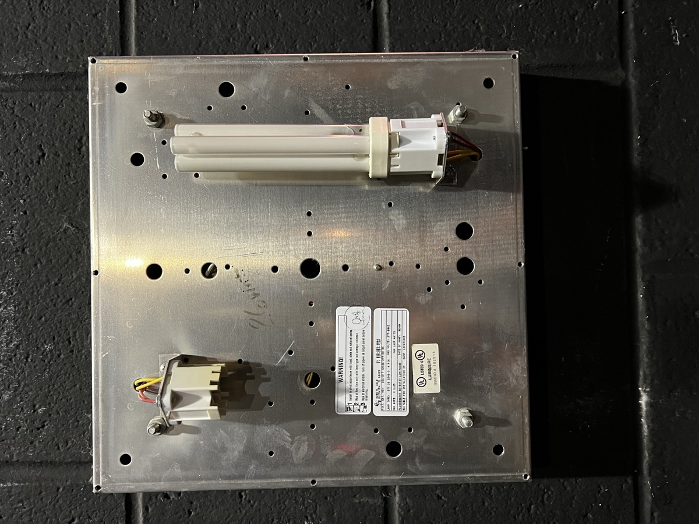
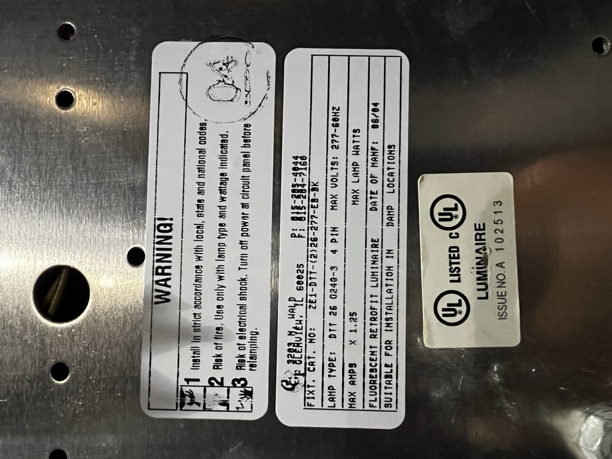

# Equipment

## Scissor Lift

UpRight X26N

## Theatre MacBook Pro

* MacBookPro6,2
* MacOS 10.6.8 (Snow Leopard)
* Supports up to 10.13.x (High Sierra)
* 15” Mid-2010
* Core i7 2.66 GHZ Dual-Core
* 4GB RAM (PC3-8500 DDR3, 2GB x2)
* Supports up to 8GB (4GBx2)
* A1321 Battery

## Theatre Fog Machine

[ADJ Mister Kool II](https://www.adj.com/mister-kool-ii)

* 700W heater
* Uses standard water-based fog juice and ice cubes
* [ADJ Kool Fog](https://smile.amazon.com/ADJ-Products-Juice-Lying-Machine/dp/B01DUBUI70/) uses Demineralized (Distilled) Water (64-68%), Propylene Glycol (<30%), Triethylene Glycol (<6%)
* Output Port: 140mm x 20mm
* Top of port 78mm from base

[Froggy’s Fog - Bog Fog](https://www.froggysfog.com/bog-fog-extreme-hdf-high-density-fog-juice-machine-fluid.html)

* Uses De-ionized/Distilled Water, Propylene Glycol, Triethylene Glycol (ratios are proprietary, noted as a trade secret)

[Chauvet High Performance Haze Fluid (HFG)](https://www.chauvetdj.com/products/haze-fluid-gallon/)

* Contents only described as “osmozed water and glycol derivatives”

[Vegetable Glycerine & Propylene Glycol Base VGPG 70-30](https://smile.amazon.com/gp/product/B06XKBXSC6/)

## Replacements

### Ear Pads for Stage Crew Headsets

[Mfg. Model ULEPD](https://eartec.com/product/ultralite-leatherette-earpad-2/) (These easily twist and pop off)
Need 6 total: 3x 2-Packs

### Floor Sconces

PL7S/41/eco - 2-Pin Compact Flourescent

### Blues Lights

* “Blues” Fixtures in Wings
* 26W Compact Fluorescent Lamp
* Philips PL-C 26 W 835 4P Alto
	* The value 835 means 3500K color temperature. 841 would be 4100K.

**Luminaire:**

* ZE1-DTT-(2)26-277-EB-BK
* 12.5” Square
* 2” Deep
* 26W Bulb x2
* DTT 26 G24Q-3 4-Pin

