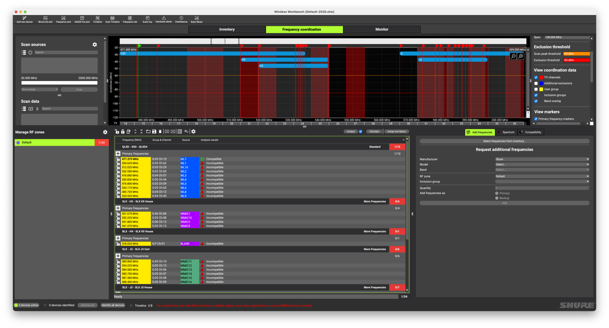
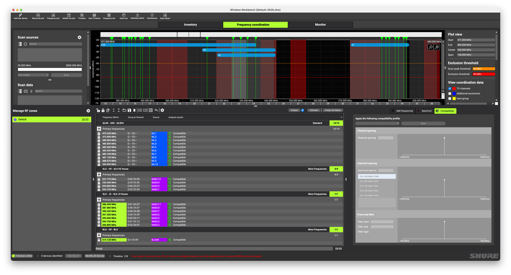

# Wireless Mic Frequencies

All wireless mics still require a frequency band in which to work, and there is only so much space available as recent FCC changes altered the consumer bands. This is important as all wireless mics MUST be capable of working within the 470-960 MHz range but only legally allowed for roughly 2/3 of that allotted space.

```
470–608 MHz     Wireless Mics Allowed
608–614 MHz     Reserved (Radio/Medical)
614–698 MHz     Cellular Carriers (as of 2020)
```

## Shure Mic Systems

This provides only 138 MHz of bandwidth to share among wireless devices, and as an added hurdle there are over-the-air TV broadcasts which overlap this range. Each of the Shure systems works within a specific band of the available 470-608 MHz range and each has overlap with stations within 30mi the Duluth area. Some stations are more powerful than others so those that are considered "high power" must be taken into consideration.

| System | Band | UHF Range   | TV Channels | Usable Range |
|--------|------|-------------|-------------|--------------|
| QLXD4  | G50  | 470–534 MHz | 18-19 (494-506 MHz), 21-22 (512-524 MHz) | 470–494 MHz, 506–512 MHz, 524–534 MHz<sup>1</sup> |
| BLX4R  | H9   | 512–542 MHz | 21-22 (512-524 MHz), 25 (536-542 MHz) | 524–536 MHz |
| SLX4   | H5   | 518–542 MHz | 21-22 (512-524 MHz), 25 (536-542 MHz) | 524–536 MHz |
| SLX4   | J3   | 572–596 MHz | 31–32 (572-584 MHz), 34 (590-596 MHz) | 572–596 MHz |

<sup>1</sup> Overlap between the G50 and H9/H5 bands. This means all QLXD4 mics much remain in the range 470-512 MHz.

There are unused portions of the 470-608 MHz range which are not used by any wireless mics as the existing systems do not extend over these ranges: 542-548 MHz and 554-572 Mhz.

## Best Practices

Use the [Wireless Workbench](https://www.shure.com/en-US/products/software/wwb?variant=WWB) software from Shure to plan out frequency coordination to ensure all mic receivers are placed among the non-conflicting, non-interference ranges available. This allows you to enter all available wireless systems as inventory then calculate the best frequencies to use for each device. The software will either pick a distinct frequency, for those devices that can be programmed with a specific value like the QLXD's, or will map to the nearest Group/Channel number for systems which rely solely on that method for assignments. The software will also take care of flagging overlapping TV stations which need to be avoided and the user can specify any other known sources of interference to aid in selecting clean frequencies.

When attempting to fit all of the available wireless mics into the available frequency range it becomes obvious that the current configuration is not optimal. There are several TV stations in the area which overlap with existing assignments.



By removing concerns over some mid-power TV stations this opens up a few small frequency gaps to fit the available systems, at the cost of ignoring the 6 SLX (J3) units in the mobile cart in the name of making all of the in-house mics available for use. This poses the perfect use-case for replacing 6 units with a newer system that can better utilize the unused space in the middle of the 470-608 MHz frequency range.



## House Channel Assignments

For best results in the theatre space as of March 2026, please [refer to this document for assignments](files/House-Channel-Assignment.pdf) of Frequencies or Groups and Channels for the available wireless mic systems. All intended mic channels should be clearly labelled in the PDF, though the SLX units show the H5 or J3 frequency band in the lower-right corner of each receiver. The BLX4R and all SLX units will only accept a Group/Channel selection while the QLXD units can be dialed in directly to a frequency.

**Note:** For the BLX4R press and hold the Group or Channel button to allow selection of a specific value. If you quickly press either button the receiver will only perform a scan for an available group/channel.
