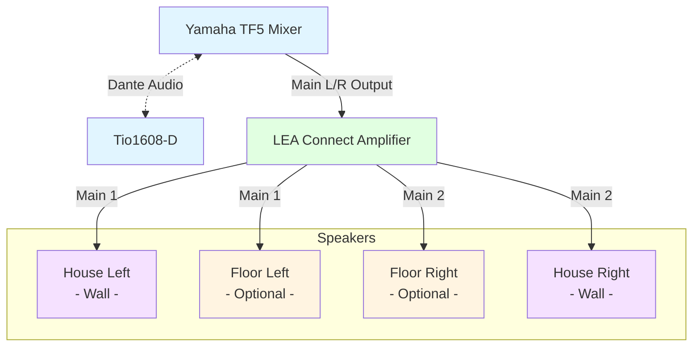
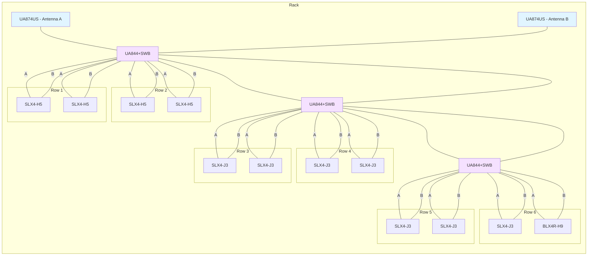

# House Audio Equipment

## House Audio - Signal Flow



## [Yamaha TF5](https://usa.yamaha.com/products/proaudio/mixers/tf/index.html)

[User Manual](https://usa.yamaha.com/files/download/other_assets/8/392718/tf5_en_rm_v45_j0.pdf)

* 33 motor faders (32 channels + 1 master)
* 48 input mixing channels (40 mono + 2 stereo + 2 return)
* 20 Aux (8 mono + 6 stereo) + Stereo + Sub buses
* 8 DCA groups with Roll-out
* 32 analog XLR/TRS combo mic/line inputs + 2 analog RCA pin stereo line inputs
* 16 analog XLR outputs
* 34 x 34 digital record/playback channels via USB 2.0 + 2 x 2 via a USB storage device
* 1 expansion slot with NY64-D audio interface card for Dante support

**Network IP:** 192.168.1.2

**Optional Software**

* [TF StageMix for iPad](https://usa.yamaha.com/products/proaudio/software/tfstagemix/index.html) - [User Guide](https://usa.yamaha.com/files/download/other_assets/7/392777/tf_stagemix_en_ug_v45_g0.pdf)
* [TF Editor for PC/Mac](https://usa.yamaha.com/products/proaudio/software/tfeditor/index.html) - [User Guide](https://usa.yamaha.com/files/download/other_assets/1/392731/tfeditor_en_ug_v45_i0.pdf)

### Yamaha Inputs/Outputs

These tables should match the view of inputs or outputs when selecting one of the 3 buttons at the top-right of the mixer console.

**Input 1**

| Fader | Source | Notes |
|-------|--------|-------|
| 1  | Input 1  | WMIC 9 (17) |
| 2  | Input 2  | WMIC 10 (18) |
| 3  | Input 3  | WMIC 11 (19) |
| 4  | Input 4  | BLX4R (20) |
| 5  | Input 5  |  |
| 6  | Input 6  |  |
| 7  | Input 7  |  |
| 8  | Input 8  |  |
| 9  | Input 9  |  |
| 10 | Input 10 |  |
| 11 | Input 11 |  |
| 12 | Input 12 |  |
| 13 | Input 13 |  |
| 14 | Slot 14 | Tio1608 Input 14 (Stage L) |
| 15 | Slot 15 | Tio1608 Input 15 (Stage C) |
| 16 | Slot 16 | Tio1608 Input 16 (Stage R) |
| 17 | Input 17 | WMIC 1 (1) |
| 18 | Input 18 | WMIC 2 (2) |
| 19 | Input 19 | WMIC 3 (3) |
| 20 | Input 20 | WMIC 4 (4) |
| 21 | Input 21 | WMIC 5 (5) |
| 22 | Input 22 | WMIC 6 (6) |
| 23 | Input 23 | WMIC 7 (7) |
| 24 | Input 24 | WMIC 8 (8) |
| 25 | Input 25 |  |
| 26 | Input 26 |  |
| 27 | Input 27 |  |
| 28 | Input 28 |  |
| 29 | Input 29 | CD/Aux (L) |
| 30 | Input 30 | CD/Aux (R) |
| 31 | Input 31 | PC (HDMI) |
| 32 | Input 32 |  |

**Input 2**

| Fader | Source | Notes |
|-------|--------|-------|
| 33 | USB 1  |  |
| 34 | USB 2  |  |
| 35 | USB 3  |  |
| 36 | USB 4  |  |
| 37 | USB 7  |  |
| 38 | USB 8  |  |
| 39 | USB 9  |  |
| 40 | USB 10 |  |

**Output**

As of February 2026 the Matrix outputs have been utilized to produce a mono output using the main left + main right feeds. This allows a single output to carry both the left and right channels for the house which is useful for sending clean signals to other devices. For example, the lobby speakers are given a summed stereo to mono output reduced by 2dB and with an EQ that cuts some of the low-end audio which cannot be played through the speakers. Another output provides a summed stereo output reduced by 20dB for recording via the iMac when using the CCTV system.

| Output | Source | Notes |
|--------|--------|-------|
| 1  | Aux 1 | Stage Monitors |
| 2  | - |  |
| 3  | Aux 3 | Wing Monitors |
| 4  | - |  |
| 5  | - |  |
| 6  | - |  |
| 7  | - |  |
| 8  | - |  |
| 9  | - |  |
| 10 | - |  |
| 11 | - |  |
| 12 | - |  |
| 13 | Matrix2 | Booth iMac |
| 14 | Matrix1 | Lobby Amp |
| 15 | Main L | House Left |
| 16 | Main R | House Right |

> 💡 Everything is just signal routing. The mixer just gets audio from point A to point B.

## [Yamaha Tio1608-D Stagebox](https://usa.yamaha.com/products/proaudio/interfaces/tio1608-d2/index.html)

Thsi is a Dante-equipped audio I/O rack, located in the stage-right wing in a wall-mounted equipment rack which includes an amplifier for the dressing room speakers. This provides 16 inputs and 8 outputs direct to the Yamaha TF5 mixer in the booth. This uses ethernet (network) cabling which is labelled in the booth on a wall jack, and connects to the Dante expansion card on the TF5. Patching is controlled by software automatically thanks to a Quick Config feature of these Yamaha devices, and can be configured to any fader or output available to the mixing console.

[User Manual](https://usa.yamaha.com/files/download/other_assets/6/1628076/tio1608d2_en_om_b0.pdf)

**Front Panel Switches**

```
Quick Config: ON
Unit ID: 1
+48V Master: ON
```

This device uses [Dante](https://www.getdante.com/meet-dante/what-is-dante/) ([Digital Audio Network Through Ethernet](https://en.wikipedia.org/wiki/Dante_(networking))) is capable of working directly with the Yamaha TF5 without any special configuration by using the Quick Config option. When enabled and set to Unit ID #1, the Tio1608 will automatically appear to the Yamaha TF5 as inputs named "Slot" 1-16, and outputs will match the Aux busses 1-6 while 7 and 8 are Main Left and Main Right, respectively.

**Inputs**

Since faders 1-4 are in use on the TF-5, this makes slots 1-4 unavailable on the Tio stagebox. Inputs 14-16 are configured to use phantom power to operate the condenser microphones over the stage. Note tha tin this case, "stage left" and "stage" right" is from the point of view of the audio operator in the tech booth.

| Fader | Source | Notes |
|-------|--------|-------|
| 1  | Input 1  | -Unavailable- |
| 2  | Input 2  | -Unavailable- |
| 3  | Input 3  | -Unavailable- |
| 4  | Input 4  | -Unavailable- |
| 5  | Input 5  |  |
| 6  | Input 6  |  |
| 7  | Input 7  |  |
| 8  | Input 8  |  |
| 9  | Input 9  |  |
| 10 | Input 10 |  |
| 11 | Input 11 |  |
| 12 | Input 12 |  |
| 13 | Input 13 |  |
| 14 | Input 14 | Condenser Mic (Stage L) |
| 15 | Input 15 | Condenser Mic (Stage C) |
| 16 | Input 16 | Condenser Mic (Stage R) |

**Outputs**

| Output | Source | Notes |
|--------|--------|-------|
| 1  | Aux 1 | Stage Monitors |
| 2  | - |  |
| 3  | Aux 3 | Wing Monitors |
| 4  | - |  |
| 5  | - |  |
| 6  | - |  |
| 7  | Main L | Dressing Rooms |
| 8  | Main R | Dressing Rooms |


## [LEA Connect 704 Amplifier](https://leaprofessional.com/products/network-connect/704n/)

Networked 4-channel amplifier with 700 watts per channel.

> 💡 Let the amplifier handle physics; the mixer will handle the blending of sources.

[User Manual](https://leaprofessional.com/wp-content/uploads/2021/09/Network-Connect-Series-Manual-7-25.pdf)

**Network IP:** 192.168.1.3

**Inputs**

* IN1 - Yamaha TF5, Output 15 (Left)
* IN2 - Yamaha TF5, Output 16 (Right)

**Outputs**

* CH1 - House Wall Left
  * High Pass Filter<sup>1</sup>: 100Hz, Linkwitz-Riley @ 24dB/oct
* CH2 - House Wall Right
  * High Pass Filter<sup>1</sup>: 100Hz, Linkwitz-Riley @ 24dB/oct
* CH3 - House Floor Left
  * Low Pass Filter<sup>2</sup>: Linkwitz-Riley, 120Hz @ 24dB/oct, Trim -3db
  * Parametric EQ<sup>3</sup>: -4dB @ 94Hz
  * Delay<sup>4</sup>: 9.8ms
* CH4 - House Floor Right
  * Low Pass Filter<sup>2</sup>: Linkwitz-Riley, 120Hz @ 24dB/oct, Trim -3db
  * Parametric EQ<sup>3</sup>: -4dB @ 94Hz
  * Delay<sup>4</sup>: 9.8ms

<sup>1</sup> The house needs a high-pass filter at 100Hz to avoid attempting to handle frequencies they are not designed to manage. This ensures the house can still deliver sufficient range even without the floor speakers in use.

<sup>2</sup> The primary purpose of the floor speakers is to reinforce low-end frequencies which are missing from the house speakers. Therefore, a low-pass filter at 120Hz ensures they avoid competing with the house audio.

<sup>3</sup> Due to a mild spike around 94Hz in the theatre a minor reduction in that frequency is necessary to avoid reverberation.

<sup>4</sup> The distance between the house speakers (on-wall) and the floor speakers (on the apron) is approximately 10ft. This equates to a needed delay of ~9.8ms to ensure proper timing. Should this change, take measurements using a laser measure from various locations on each side of the audience. Calculate the delay as ((Distance to Wall Speaker - Distance to Floor Speaker) / 1125) * 1000 where distance is in feet and 1,125 ft/sec. is the speed of sound. This will give you a delay in milliseconds. Average your calculations to get a suitable delay.

> 💡 Mains handle mids and highs, floors handle low-end reinforcement.

## House Speakers

**Wall Mains - [Model Unknown]**


**Floor Speakers - [Peavey PV215](https://assets.peavey.com/literature/specs/114378_18647.pdf)**

* 4ohms 700W Max
* 58Hz-17kHz
* 15” Woofers

| Speaker        | Role                    | Frequency Range | Notes                 |
| -------------- | ----------------------- | --------------- | --------------------- |
| Wall Mains     | Primary Coverage        | 100 Hz – 24 KHz | Speech & Localization |
| Floor Speakers | Low-Freq. Reinforcement | 50–120 Hz       | Delayed & Trimmed     |

**Stage & Wing Monitors**

[ElectroVoice ZLX12BT](https://products.electrovoice.com/na/pt/zlx-12bt)

## Lobby Amplifier

This amplifier is connected to the output #14 from the Yamaha TF5. Located in the large floor rack near the staircase and railing.

* [TOA 900 Series II Amplifier A-903MK2](https://www.toaelectronics.com/en-us/products/detail/a903mk2ul)
* [M-01 Balanced Mic Input Module](https://www.toaelectronics.com/en-us/products/detail/m01m)

## Booth Corner Rack

Standard 19" rackmount case with wireless microphone receivers and antenna distribution system. Includes a power conditioner, CD player with Aux input, and an FM-based assistive listening system.

| QTY | Equipment | Notes |
|-----|-----------|-------|
| 3 | [Shure UA844+SWB](https://www.shure.com/en-US/products/accessories/ua844p?variant=UA844+SWB) | Active Antenna Distribution (470-960 MHz) |
| 2	| [Shure UA874US Antennas](https://www.shure.com/en-US/products/accessories/ua874?variant=UA874US) | Active Directional Antennas (470-698 MHz) |
| 4	| [Shure SLX4 (H5 518–542 MHz)](https://www.shure.com/en-US/docs/guide/SLX) | Analog Receivers for Belt Packs WMIC 1,2,9,10 |
| 7	| [Shure SLX4 (J3 572–596 MHz)](https://www.shure.com/en-US/docs/guide/SLX) | Analog Receivers for Belt Packs WMIC 3,4,5,6,7,8,17 |
| 1	| [Shure BLX4R (H9 518–542 MHz)](https://www.shure.com/en-US/products/wireless-systems/blx_wireless/blx4r?variant=BLX4R%3D-H9) | Wireless Mic |
| 1 | [Furman M-8Lx](https://www.amazon.com/Furman-M-8X2-Outlet-Conditioner-Protector/dp/B003BQ91Y6) | Power Distribution |
| 1	| [Denon DN-300Z](https://www.denonpro.com/products/dn-300z.html) | CD Player + Aux Input |
| 1	| [Clear-Com DX410](https://www.clearcom.com/product-family/hme-dx410-wireless/) | Headset Communication |
| 1 | [Listen LT-800 FM](https://www.listentech.com/shop/product/stationary-rf-transmitter-72mhz/) | Assistive Listening |

## Shure Antenna Distribution

