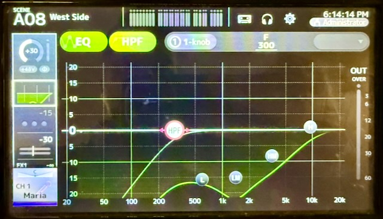
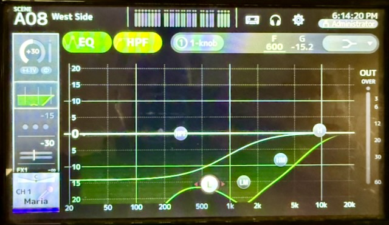
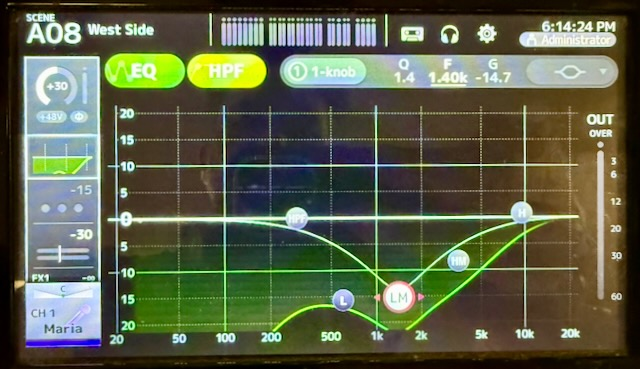
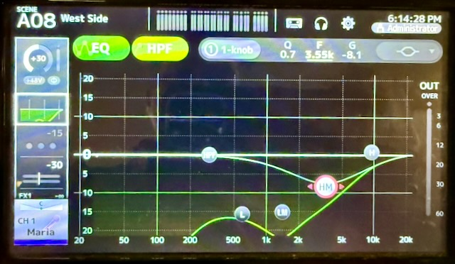
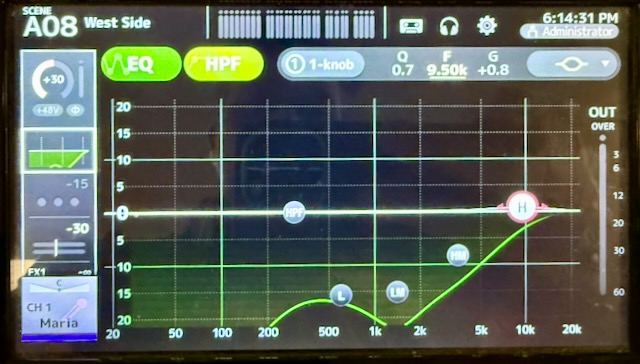
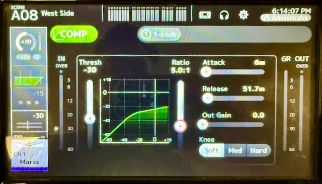

# Performing Mic Checks

One of the key tasks for a live performance is vocal mixing, though before a show begins you must perform an effective mic check. This involves setting the gain, an acceptable volume plus overhead room, performing EQ for clarity, and enabling compression for comfort.

Before you worry about EQ or compression it is absolutely important to first ensure that a performer's microphone is delivering a suitable signal to the mixer. Begin by isolating only their microphone (press the ON button for the Yamaha TF-5 channel), turn off all other mics or sources, and ask the room for quiet so you can clearly hear the performer.

## Overview

This is the heart of the process you will follow for mic checks so it comes before all other content. Once you know what to expect you can return here to review as needed.

1. Turn ON the performer's channel and begin with the fader at infinity (all the way down).
2. Have the performer confirm their microphone (handheld or body-pack) is turned on, and is not muted.
3. Ask them to speak normally but also to PROJECT as they would during their performance.
3. Select the INPUT configuration area for the channel and watch the gain indicator markers.
4. Raise the gain until the performer's speaking causes the middle indicator to remain green most of the time.
5. Slowly raise the fader to Unity (0) and listen for any obvious feedback, and continue to adjust gain if needed.
   - The goal at this point is to ensure the performer is at a consistent level which has "headroom" for further boosting.
   - They will not sound the best at this point if no EQ or compression settings have yet been applied, and that's OK.

Once a consistent volume is set you can now adjust the EQ and compressor settings, alternating between spoken and sung lines to ensure they sound clear. To ensure feedback-free operation during the performance, push the fader higher than expected (+10dB or +20dB) to ensure the added volume does not suddenly change the performer's profile. Adjust the EQ as needed if you begin to hear an immediate high squealing or the slow building of a low rumble as these indicate the potential for feedback.

> Why push the performer's mic volume so high? A performer may become over-amplified either due to a need during the show, or if they become double-amplified (such as singing closely to another performer's mic). Pre-stressing the system now helps to avoid problems during the show!

**Additional Resources:**

- [MusicMixingGuy - EQ Presets for Vocals](https://www.musicguymixing.com/eq-presets-for-vocals/)
- [MusicMixingGuy - Vocal Compression Settings](https://www.musicguymixing.com/vocal-compression-settings-live/)
- [MusicMixingGuy - Essential EQ Tips for Live Sound](https://www.sweetwater.com/insync/essential-eq-tips-for-live-sound/)
- [MusicMixingGuy - EQ Cheat Sheet](files/EQ-Cheat-Sheet-From-Music-Guy-Mixing.pdf)
- [MusicMixingGuy - Compression Cheat Sheet](files/Compression-Cheat-Sheet-From-Music-Guy-Mixing.pdf)

---

## EQ Fundamentals

### What is EQ?

**EQ (Equalizer)** adjusts the balance of different frequency ranges in an audio signal. Think of it as tone control - like bass and treble knobs, but with much more precision and control over specific frequency ranges.

### Common EQ Terms

**HPF (High-Pass Filter)** / **Low-Cut Filter**

- Removes frequencies below a set point (typically 80-100 Hz for vocals)
- Cleans up rumble, handling noise, stage vibrations, and low-end mud
- **Use on vocals:** Always! Start around 80-100 Hz and adjust to taste
- Does NOT affect the high frequencies - it lets high frequencies "pass" through

**Frequency Bands**

- **Lows (20-250 Hz)**: Bass, body, rumble, mud
- **Low-Mids (250-500 Hz)**: Warmth or muddiness - the problem zone
- **Mids (500 Hz-2 kHz)**: Presence, fullness, can sound nasal
- **Upper-Mids/Presence (2-5 kHz)**: Clarity, intelligibility, articulation
- **Highs (5-20 kHz)**: Brilliance, air, sibilance

**Cut vs. Boost**

- **Cut**: Reduces level at a specific frequency (preferred method)
- **Boost**: Increases level at a specific frequency (use sparingly)

**Q (Bandwidth)**

- How wide or narrow the affected frequency range is
- **Narrow Q**: Surgical cuts for specific problems (feedback, harsh resonances)
- **Wide Q**: Broad tonal shaping (warmth, presence)

**Parametric EQ**

- EQ that applies curves across the available frequency bands
- Adjusting any point will "bend" the response curve to nearby points
- The type of EQ you will use for a single channel

**Graphic EQ**

- EQ that affects only distinct frequency bands when adjusted
- Offers an immediate adjustment (cut or boost) at a specific frequency
- The type of EQ you may see on a house amplifier or mixer's Main outputs

---

## Key Principles for Live Vocal Mixing

1. **Cut first, boost second** - Remove problem frequencies before adding desired ones
2. **Focus on the mix** - Make channels work together, not perfect in isolation
3. **Less is more** - Subtle adjustments are better than drastic changes in live settings
4. **Use your ears** - Numbers are ONLY provided as guides, but the sound is what matters
5. **Start with flat EQs** - Always reset the EQ and Compressor for a channel when changing performers

---

## Typical EQ Settings for Vocals

### Vocal EQ - General Starting Point

This is by no means a "set-it and forget-it" range of adjustments but a basic starting point for vocals. Always adjust beyond these defaults from in the house, listening from various locations though you can always start from the middle of the audience if time is a factor. Once you apply this default to the first vocal channel you can use the Yamaha's TF-5 menu to easily copy and paste EQ settings to other vocal channels.

```
HPF (High-Pass):   80-300 Hz (adjust based on voice depth, eg. lower range)
Lows (500 Hz):     Cut 2-10 dB (reduces mud and cloudiness) using low Q (~0.7)
Low-Mid (1.5 kHz): Cut at least 10 dB using a narrow Q of 1.4-1.8 for precision
Hi-Mid (4 kHz):    Cut 2-10 dB (for presence and clarity) using low Q (~0.7)
Highs (10 kHz):    Cut 1-2 dB (for breathiness) using low Q (~0.7)
```

High-Pass Filter Example:



EQ Lows Example:



EQ Low-Mid Example:



EQ High-Mid Example:



EQ Highs Example:



> **Note:** On the Yamaha TF-5 the EQ curve pattern for the Lows should look like this `=>-` indicating the EQ curve will NOT affect frequencies prior to what is selected. All other EQ points will use a symbol which looks like this `-<=>-` indicating the EQ curve will follow through from frequencies before and after what is selected.

### Frequency-Specific Problem Solving

Many of the following suggestions will help you identify which point on the EQ needs adjustments but you should always let your ears be the guide! If something does not sound pleasing then you can use the following suggestions to make changes. If a tablet with the TF StageMix app is available, this will be the easiest way to perform EQ adjustments as you can just slide your finger on the screen to make adjustments rather than with knobs or tapping alone.

**Muddiness / Lack of Clarity**

- **Problem area:** 200-500 Hz (low-mids)
- **Solution:** Cut 2-4 dB around 300-500 Hz with moderate Q
- **Also try:** HPF higher (100-120 Hz if voice can handle it)

**Nasal / Honky Sound**

- **Problem area:** 1-3 kHz  
- **Solution:** Cut 2-3 dB around 1.5-2 kHz (use dynamic cut if intermittent)
- **Be careful:** Too much cut creates a hollow, distant sound

**Hollow / Thin Sound**

- **Problem area:** Missing 1-2 kHz
- **Solution:** Boost 1-2 dB around 1-1.5 kHz to add fullness
- **Also try:** Boost 200-300 Hz for more body

**Harshness**

- **Problem area:** 3-5 kHz (upper-mids)
- **Solution:** Dynamic cut 2-4 dB around 3.5-4 kHz
- **Why dynamic:** Harshness often comes and goes with different words/notes

**Sibilance** (Excessive "S" sounds)

- **Problem area:** 5-10 kHz (often centered around 6-7 kHz)
- **Solution:** Dynamic cut 3-6 dB in the 5-8 kHz range
- **Best tool:** De-esser (specialized compressor for sibilance)
- **Alternative:** Dynamic EQ targeting the specific sibilant frequency
- **Set threshold:** Use the worst "S" sound to set your threshold

**Plosives** (Booming "P" and "B" sounds)

- **Problem area:** 150 Hz
- **Solution:** Dynamic cut 3-6 dB at 150 Hz with narrow Q
- **Why dynamic:** Targets plosives without thinning out the entire vocal
- **Prevention:** Good mic technique and pop filters help

**Lack of Presence / Gets Lost in Mix**

- **Problem area:** Not enough 3-5 kHz
- **Solution:** Boost 2-3 dB around 4 kHz (presence frequency)
- **Also try:** Small high shelf boost at 10 kHz (1-2 dB)
- **Caution:** Don't push too hard - harsh vocals are worse than buried vocals

---

## Compression Fundamentals

### What is Compression?

**Compression** automatically reduces the volume of loud parts of a signal, making the overall level more consistent. It's like an automatic volume control that brings peaks down, making it easier to keep vocals present in the mix without constant fader riding. Thought of another way, compression ensures that the dynamic range of a performer does not exceed an acceptable upper bound for comfortable listening.

### Common Compressor Terms

**Threshold**

- The level at which compression begins
- Signal below threshold = unaffected
- Signal above threshold = compressed
- **Setting it:** Adjust so the compressor engages on the louder notes, not constant background

**Ratio**

- How much the signal is reduced once it crosses the threshold
- **2:1** = gentle (2 dB over threshold becomes 1 dB over)
- **4:1** = moderate (4 dB over threshold becomes 1 dB over)  
- **8:1** = aggressive limiting (8 dB over threshold becomes 1 dB over)
- **Higher ratio** = more dramatic compression

**Attack**

- How quickly compression engages after signal crosses threshold
- **Fast attack (1-5ms)**: Catches transients immediately, smooths everything
- **Slow attack (10-30ms)**: Lets initial transient through (punch, clarity), then compresses
- **For vocals:** 3-10ms is typical

**Release**

- How quickly compression stops after signal drops below threshold
- **Fast release (10-50ms)**: Compression stops quickly, follows dynamics closely
- **Slow release (100-200ms)**: Smooth, musical, less obvious compression
- **For vocals:** 100ms is a good starting point for live

**Knee**

- How gradually compression ratio increases as signal approaches threshold
- **Hard knee (0 dB)**: Full ratio exactly at threshold - more obvious
- **Soft knee (12 dB)**: Gentle increase in ratio before/after threshold - transparent
- **For live vocals:** Soft or Moderate knee (6-12 dB) for smooth, natural sound

**Gain Reduction (GR)**

- How much the compressor is reducing the signal in real-time
- Shown on meter with negative numbers (-3 dB, -6 dB, etc.)
- **Goal for live vocals:** 5-10 dB average, 20 dB maximum

**Make-up Gain / Output Gain**

- Adds gain after compression to compensate for reduced level
- Keeps the fader position/mix balance accurate
- Regardless of gain reduction, avoid using output gain or do so **sparingly**

---

## Using a Compressor for Live Vocals

### Why Compress Vocals in Live Sound?

- Smooths inconsistent mic technique (moving toward/away from mic)
- Keeps vocals present without constant fader adjustments  
- Controls sudden peaks that could cause distortion or feedback
- Adds perceived loudness without increasing actual peak level

### Live Vocal Compression Settings

**IMPORTANT:** Live compression is LIGHTER than studio compression due to:

- More unpredictable dynamics
- Mic bleed from other instruments
- Risk of amplifying background noise
- Need for natural, energetic sound

**Typical Starting Settings:**

Use these settings as a baseline for vocals and adjust as needed for each performer.

```
Threshold:     Set (reduce) by -10 or -20 as a starting point
               (Make sure the actor covers both normal speaking lines and their loudest singing voice)
               
Ratio:         3:1 or 4:1 as necessary for a vocalist, or 5:1 at a maximum
               (Expect to use a higher value for a very powerful singer)
               
Knee:          Opt for the Soft knee to prevent noticeable changes

Attack:        4-6ms (lets consonants punch through before compressing)

Release:       50-100ms (longer = smoother and less obvious)

Output Gain:   0 unless you absolutely need to boost!
```



### Setting Threshold for Live Vocals

1. **Watch the performer's technique:**

   - Stationary (acoustic guitar player) = more predictable
   - Moving around (energetic vocalist) = less predictable

2. **Set threshold to average level, not quietest level**

   - Too low = compresses everything including bleed and noise
   - Too high = only catches extreme peaks, defeating the purpose

3. **Use gain reduction meter:**

   - Should show 4-5 dB on average phrases
   - Peaks hitting 8 dB maximum
   - Not constantly engaged

### Advanced: Two-Compressor Chain

Why yes, you CAN apply compressors to compressed channels! In cases where a group of performers may exist on a single channel, such as a DCA (group) assignment. Compression can be applied for an individual vocalist to match their performance while a compressor on the DCA will ensure a group of vocalists remains within an expected range.

For vocalists who belt or scream occasionally:

**Compressor 1 (Main):**

```
Threshold:     Average level
Ratio:         3:1
Attack:        3ms
Release:       100ms
Purpose:       Smooth overall dynamics
```

**Compressor 2 (Safety Limiting):**

```
Threshold:     Much higher (only catches belts/screams)
Ratio:         8:1 (aggressive limiting)
Attack:        1ms (catch it immediately)
Release:       50ms (quick recovery)
Purpose:       Protect against extreme peaks and audience ear damage
```

### What Compression Cannot Do

- **Fix bad mic placement** - Get the mic positioned correctly first
- **Replace good mic technique** - Work with performer on consistency
- **Eliminate feedback** - Use EQ, mic placement, and monitor positioning
- **Make a bad mix good** - Get fader balance and EQ right first

---

## Practical Workflow for Vocal Soundcheck

### 1. Start with Gain Staging (No EQ/Compression Yet)

- Have vocalist sing at performance volume
- Set input gain so meter shows healthy signal (-12 to -6 dB)
- Fader at unity (0 dB)  
- No clipping/red lights

### 2. Apply High-Pass Filter

- Engage HPF at 80-100 Hz
- Listen while adjusting - stop before it thins out the voice
- Male vocals might need lower (80 Hz), female higher (100-120 Hz)

### 3. Cut Problem Frequencies

Listen for issues and address them **in this priority order:**

1. **Mud** (500 Hz) - Makes everything cloudy
2. **Sibilance** (5-8 kHz) - Painful on larger systems  
3. **Harshness** (3-5 kHz) - Listener fatigue
4. **Nasality** (1-3 kHz) - Annoying but less critical

Use **narrow Q for surgical cuts**, **wide Q for broad tone shaping**.

### 4. Add Compression

- Set threshold to average level (aim for 4-5 dB GR)
- Start with 3:1 ratio
- 3ms attack, 100ms release
- Add output gain to compensate

### 5. Add Presence (If Needed)

Only after fixing problems:

- Small boost at 4 kHz for clarity (2-3 dB max)
- High shelf at 10 kHz for sparkle (1-2 dB)

### 6. Check in Context of Full Mix

- Bring up band/backing tracks
- Adjust vocal level for proper balance
- Re-check EQ moves in context (solo'd sounds can be misleading)
- Make sure vocals sit on top of the mix without being too loud

### 7. Walk the Room

- Check vocal intelligibility from different positions
- Front, back, sides, under balcony if applicable
- Adjust as needed for coverage

---

## Common Mistakes to Avoid

1. **Boosting too much at 4 kHz** - Creates harsh, fatiguing vocals
2. **Setting threshold too low** - Compresses everything including noise and bleed
3. **Using studio ratios (8:1) for main compression** - Kills dynamics and amplifies noise
4. **Not using HPF** - Wastes headroom on useless low frequencies
5. **Forgetting to add output gain** - Compression reduces level, must compensate
6. **EQing in solo** - Always check moves in context of full mix
7. **Over-compressing** - Live shows need dynamics for energy and excitement

---

## Quick Reference Chart

### EQ Frequency Guide for Vocals

| Frequency | Name | Cut to Fix | Boost to Add |
|-----------|------|-----------|--------------|
| <100 Hz | Sub/Rumble | HPF: Always filter | Never boost |
| 200-300 Hz | Body/Warmth | Muddiness, boominess | Warmth, fullness |
| 500 Hz | Low-Mids | Mud, cloudiness | (Rarely needed) |
| 1-2 kHz | Mids | Nasal, honky sound | Fullness, hollow fix |
| 3-5 kHz | Presence | Harshness | Clarity, intelligibility |
| 5-8 kHz | Upper | Sibilance, shrillness | (Rarely needed) |
| 10+ kHz | Air | (Rarely needed) | Sparkle, openness |

### Compression Settings Quick Reference

| Parameter | Studio | Live | Why Different? |
|-----------|--------|------|----------------|
| Threshold | Lower | Higher | Avoid compressing bleed/noise |
| Ratio | 6-8:1 | 2-3:1 | Preserve natural dynamics |
| Attack | Variable | 3ms | Let consonants punch through |
| Release | 30-60ms | 100ms | Smoother, less obvious |
| Knee | Hard/Med | Soft (12dB) | More transparent |
| GR Target | 6-10 dB | 4-5 dB | Less aggressive overall |

---

## Not Covered

Obviously one area not covered here is how to EQ for musical instruments. The process is much the same but may omit features such as the High-Pass Filter or may utilize other tools such as a Gate.

---

## See Also

- [Audio Terms](audio-terms.md) - Comprehensive audio terminology reference
- [Audio House System](audio-house.md) - Main theatre audio equipment
- [Audio Vocal Tuning](audio-vocal-tuning.md) - Advanced vocal mixing techniques
- [Audio Room Tuning](audio-room-tuning.md) - Acoustic optimization
