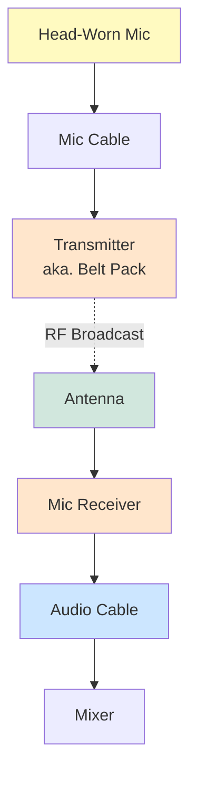

# Wireless Mics

## Signal Flow

Every wireless microphone follows the same general principles:

## RF Broadcast

Every wireless microphone needs to send a signal between the transmitter and receiver, but exactly how it does so depends on the hardware.

### Analog vs. Digital Wireless Microphones

**Analog** wireless mics transmit audio as a continuous radio signal. They typically use a process called a *compander* (compressor/expander) to reduce noise and fit the audio into a limited bandwidth. While effective, companders can sometimes introduce unwanted artifacts, such as "pops" or pumping, especially with loud or percussive sounds.

**Digital** wireless mics convert audio to a digital signal before transmission. Instead of companding, they use digital error correction to maintain audio quality and reduce dropouts or pops. This generally results in cleaner, more consistent sound, especially in challenging RF environments.

### Frequency Use and Regional Standards

Wireless microphones operate on specific frequency bands, which vary by country and region. Common bands include:

- **UHF (Ultra High Frequency):** Most common, typically 470–698 MHz in the US, but ranges vary globally.
- **VHF (Very High Frequency):** Less common, more susceptible to interference.
- **2.4 GHz:** License-free worldwide, but can be crowded due to Wi-Fi and Bluetooth.

> **Important:** Always check local regulations before operating wireless mics. Using the wrong frequencies can cause interference or violate laws.

### Channel Selections

Wireless microphone systems allow you to select different channels (frequencies) so that multiple microphones can operate at the same time without interfering with each other. Each mic (transmitter/receiver pair) must be set to a unique channel within the allowed frequency range.

**Key points:**

- Each wireless mic in a group must use a different channel to avoid interference (crosstalk).
- Most receivers and transmitters let you manually select or scan for open channels.
- Some systems offer automatic channel selection to find the clearest frequencies.
- Avoid using channels that are too close together, as this can cause intermodulation distortion (unwanted noise or interference between channels).

> **Tip:** When setting up a group of wireless mics, always coordinate channels in advance and test for interference before the show.
