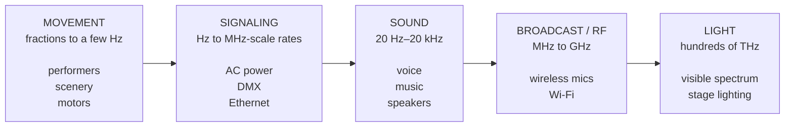
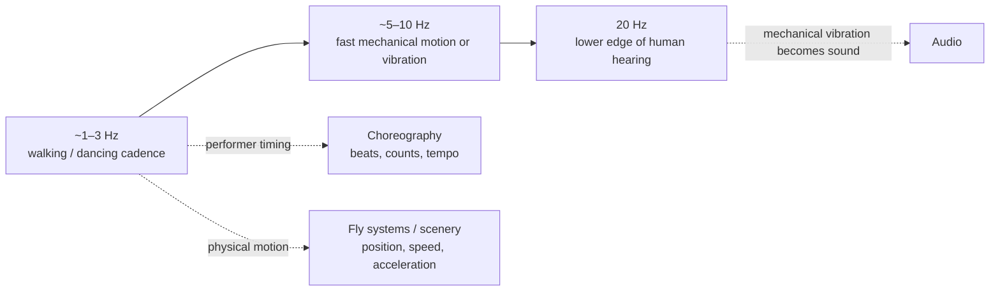
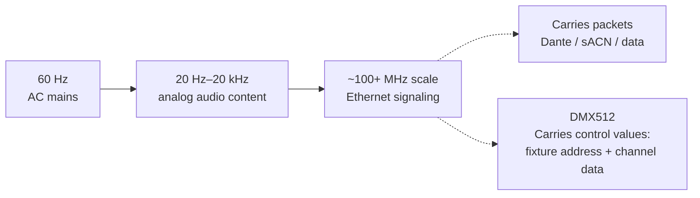
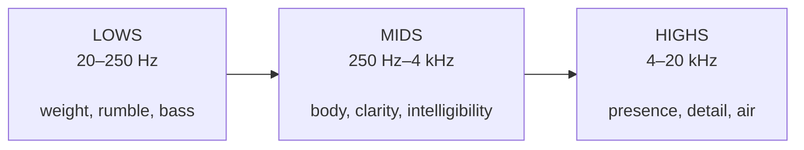
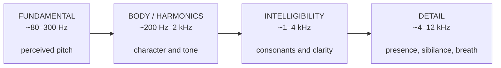
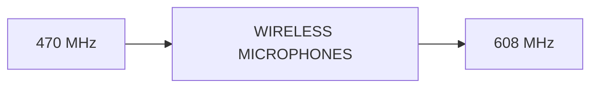

# Theatre Tech - Based in Nature

> **“An actor speaks into a mic as they're lit on stage. What do these things have in common?”**

## One Basic Concept

Modern theatre can look like a collection of unrelated technical specialties: motion, sound, electrical signaling, networking, radio, and lighting. They do not all use the same physical medium, but they can be approached through the same basic ideas from nature: **motion, energy, change, waves, frequency, information, and conversion from one form to another.**

Frequency — measured in **hertz (Hz), cycles per second** — gives us a useful common scale. The numbers may grow from a few cycles per second to hundreds of trillions, but the basic concepts do not have to become daunting.

---

## The Big Picture

These are **categories for exploring theatre technology**, not strict frequency boundaries. They overlap because theatre systems constantly convert, represent, transport, and control one kind of information using another.

---

## 1. Movement — The Slow End

A dancer's **8-count is not literally an EM frequency**, but tempo is still repetition in time. At 120 beats per minute, for example, the beat occurs at **2 beats per second = 2 Hz**. Vibration, resonance, motor control, and motion timing can all involve Hz.

---

## 2. Signaling — Power and Data

### DMX Demystified

DMX512 is the backbone of modern lighting. It sends digital electrical data over ethernet at **250,000 bits per second (250 kbaud)**. That is why DMX belongs here with **electrical signaling** as part of Ethernet. Exact spectral content depends on the Ethernet standard, so “tens to hundreds of MHz” is more useful for this talk than pretending Ethernet has one single frequency.

---

## 3. The Audible Spectrum

First, divide the audible range into the broad regions an audio engineer works with:

Those boundaries are deliberately broad rather than rigid. The point is to make **20 Hz–20 kHz** manageable: audio engineers do not think about twenty thousand individual frequencies. They think about useful regions and what changing them does to what we hear.

### The Human Voice

An actor's voice occupies only part of the full audible spectrum, but it contains much more than one frequency. The **fundamental** contributes strongly to perceived pitch, while harmonics and higher-frequency components give the voice its character and make words understandable.

Theatre audio is not simply about making an actor louder via a microphone. The engineer manages the spectrum so the actor is **clear, natural, and intelligible** without creating feedback or competing with music and other sounds.

---

## 4. Broadcast & Radio Frequencies

For theatre wireless microphones, **470–608 MHz** is a key operating range in the U.S.

This spectrum overlaps with television broadcasting, so not every frequency in that range is available at every location. **Frequency coordination** identifies usable frequencies and keeps multiple wireless microphones sufficiently separated from each other and from local TV signals to avoid interference.

---

## 5. The Visible Spectrum

Our **visual system** interprets different wavelengths of visible light as color. A lighting designer then applies **color theory** to use those colors intentionally: creating contrast, complementing costumes and scenery, directing attention, establishing mood, and helping tell the story.

---

## The Range in Numbers

| Theatre example | Approximate frequency / rate | What is actually varying? |
|---|---:|---|
| Dancing / walking cadence | ~0.5–3 Hz | Mechanical motion / timing |
| 120 BPM beat | 2 Hz | Repetition in time |
| US mains electricity | 60 Hz | Alternating voltage/current |
| Voice fundamental | ~80–300 Hz | Air pressure; represented electrically |
| Human hearing / theatre audio | 20 Hz–20 kHz | Air pressure as a waveform |
| Fast/Gigabit copper Ethernet | ~100 MHz scale | Encoded electrical signaling; standard-dependent |
| Wireless microphones | ~hundreds of MHz | Electromagnetic RF carrier |
| Wi-Fi | 2.4 / 5 GHz | Electromagnetic RF carrier |
| Visible red light | ~400–484 THz | Electromagnetic field |
| Visible violet light | ~668–790 THz | Electromagnetic field |

---

## The Through-Line

One actor standing onstage can simultaneously sit at the intersection of:

**movement → sound → digital data → radio waves → computer control → lighting → human perception**

No single person has to master every piece at once.

The useful starting point is recognizing that these are not unrelated boxes of magic. They are technologies built from the same basic physical ideas. Once those fundamentals make sense, the individual systems become much easier to approach.

**The goal is not to make every tech an RF engineer, network engineer, audio engineer, and lighting designer. It is to show that none of these systems has to be mysterious once you understand the fundamentals they share.**
