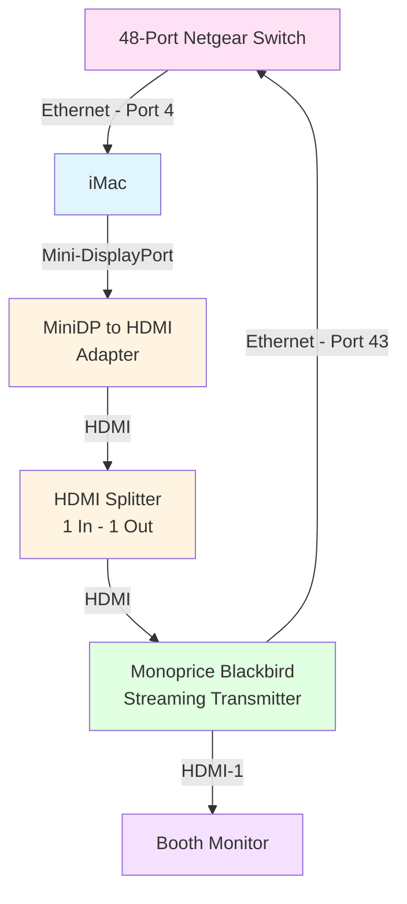
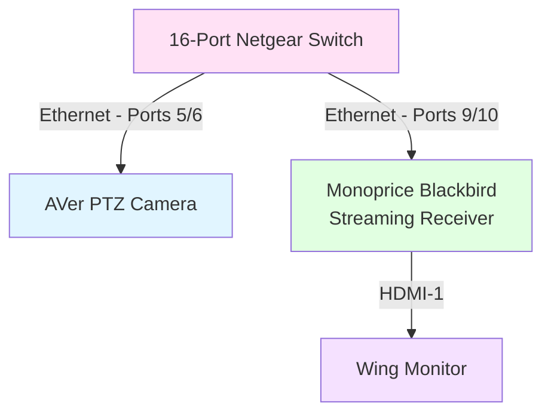

# Video Streaming

As of 2026 the DHS Theatre is equipped with a closed-circuit TV system which can be used to display videos feeds to monitors in the backstage wings and tech booth. The content for these monitors originates from an iMac running Open Broadcast Studio (OBS) which is a free video compositing suite familiar to many YouTubers and Vloggers on the Internet.

## HDMI Streaming/Distribution

Please refer to the diagrams below to understand the connections involved.

### Tech Booth - Device Connection Diagram

The iMac should be your first source of truth when troubleshooting or starting the workflow. When OBS is running it should be displaying the feeds from the 4 cameras--any problems at this stage is likely related to networking or power. If any cameras are blank, be sure that the network switches have been powered up and lights are illuminated for the ports.

The next source of truth is the booth monitor which should show the direct video feed as it enters the streaming transmitter.



**Not Shown:** One AVer PTZ Camera should be connected to the 48-port Netgear Switch on either port 9 or 10. Another AVer PTZ Camera is labelled "USB" and must be connected directly to the iMac. For more details on the networking connections please refer to the [Audio-Video Network](network-av.md) guide.

> **Monitor Setup Note:** If no video is shown on the monitor, press the button below the monitor to enter the menu mode. Follow the on-screen instructions to select the source and ensure that HDMI 1 is selected for use.

> **OBS Output Note:** If the monitor shows what looks like an extension of the iMac desktop wallpaper, close OBS and restart the program. This should restore the live preview to the streaming transmitter/splitter. If this does not work automatically you may need to right-click on the preview in OBS and select the option to extend the preview to an external monitor, selecting the non-iMac display option.

> **HDMI Splitter Note:** If no video can be seen on any monitor, check the connections to the HDMI splitter. This device allows the iMac to send a clean signal to the streaming transmitter. See the [HDMI Video Output](#hdmi-video-output) section below for more information.

### Backstage - Wing Configurations

Both the left and right wing configurations are the same, consisting of a networked camera and a streaming receiver connected to a monitor.



> Connections to the Netgear Switch are important, and do matter for whether the ethernet connection carries the live video from a camera (ports **5 & 6**) or the compressed output for streaming the composite video feed (ports **9 & 10**).

## AVer PTZ Camera Streaming

The AVer IP cameras are Pan-Tilt-Zoom (PTZ) models which can stream using either USB, RTSP, or NDI (NDI-HX). Only the AVer PTZ330N devices support native NDI output while the AVer PTZ310 can only stream using RTSP. The benefits of using NDI is a near-native, latency-free stream which can be accessed by any NDI-capable software. This avoids the need to decode the stream 

### Streaming Constraints

- These are mutually-exclusive options
    - RTSP is available when Video Mode is “Streaming”
    - NDI is only available when Video Mode is “NDI”
- Latency is much lower with NDI but increases bandwidth
    - 4Mbps = 580KB/sec.
    - 8Mbps = ~1.8MB/sec.
    - 16Mbps = ~2.9MB/sec.
    - 32Mbps = ~3.8MB/sec.

For purposes of non-broadcast, close-range distribution using 8Mbps is sufficient and has been configured on a per-camera basis already.

### Streaming Configuration

[Monoprice Blackbird H.265 Video Extender/Splitter over IP with HDMI](https://www.monoprice.com/product?p_id=43624)

These devices should not require any manual configuration or interventions, so long as the transmitter is given a valid HDMI feed. When powered on, the transmitter unit will automatically be set to the IP address 192.168.1.10 and will immediately begin transmitting.

Likewise, when powered on the receiver units will automatically assign themselves an IP address, typically starting at 192.168.10.11 and increments by 1 for each additional device. They will begin converting any available feed from the transmitter into a valid HDMI output signal.

>**Optional Test:** Using the VLC program open a Network stream to one of the following paths:
>
> * rtsp://192.168.10.10/live/main/av_stream
> * rtsp://192.168.10.10/live/sub/av_stream


## Streaming with OBS

Open Broadcast Studio is a powerful and FREE application used by many vloggers streamers across the internet. The interface is powerful though it takes some use to get familiar with the capabilities. Thankfully, given it's ubiquitious nature online there is no shortage of videos on both basics and advanced topics.

**Software Requirements**

- Open Broadcast Studio (OBS): [https://obsproject.com/download](https://obsproject.com/download) (v32+)
- NDI Tools: [https://ndi.video/tools/](https://ndi.video/tools/) (macOS Ventura or later)
    - Use the NDI Video Monitor from the NDI Tools to select and view the stream to test access.
- OBS NDI Library/Runtime: [https://github.com/DistroAV/DistroAV/releases](https://github.com/DistroAV/DistroAV/releases)
    - [https://github.com/DistroAV/DistroAV/wiki/1.-Installation#required---ndi-runtime](https://github.com/DistroAV/DistroAV/wiki/1.-Installation#required---ndi-runtime) 
- Homebrew can install both "distroav" and "libndi" (NDI runtime), see below.


### Install Homebrew and Plugins for OBS

```
/bin/bash -c "$(curl -fsSL https://raw.githubusercontent.com/Homebrew/install/HEAD/install.sh)"

brew install ffmpeg distroav
brew install —-cask ndi-tools
```

### Video Compositing

- Open OBS (after installing all libraries and runtime packages)
- OBS main window -> Settings (lower right)
    - Video
        - Base (Canvas) Resolution: 1920x1080
        - Output (Scaled) Resolution: 1920x1080
        - Common FPS Values: 30
    - Advanced
        - Color Format: NV12
        - Color Space: Rec. 709
        - Color Range: Limited (or Partial)
    - Output [Advanced] -> Streaming
    - Save (OBS may need to restart)
- For NDI Sources: OBS main window -> Sources (lower mid-left)
    - Add Source [+]
    - Look for "NDI Source" in the list of sources
    - For “Source name” select the camera stream
    - Use the highest quality/bandwidth
    - Do not enable hardware acceleration
    - Use the Low latency option
    - Use limited YUV color space
- For USB Sources: OBS main window -> Sources (lower mid-left)
    - Add Source [+]
    - Look for "Media Source" in the list of sources
    - Uncheck "Local File" and use the device IP
    - eg. `rtsp://<camera_ip>/live_st1`
    - Use the highest quality/bandwidth
    - Do not enable hardware acceleration
    - Use the Low latency option
    - Use limited YUV color space
- OBS Scenes
    - Create a scene for each camera, with necessary settings for bandwidth, frame rate, etc.
    - Add labels or other items to each camera scene as desired.
    - Create new scenes which then use the camera scenes directly, eg. "2x2 Grid":
        - Add each camera scene to the new scene (essentially "nested scenes").
        - Right-click —> Transform —> Edit Transform (resolution: 960x540)
        - Arrange as desired (dragging or using offset parameters via Transform)


### HDMI Video Output

In order to get a video feed from OBS you must use a Mini-DisplayPort to HDMI adapter with the iMac, and select Full Screen Projector from the OBS menu (right-click in the preview screen for options). This will treat the HDMI output as a second monitor with a full-screen preview of the live feed shown in the OBS interface.

> **Note:** HDMI output from the iMac typically adds HDCP (HD Copy Protection) to the signal which CANNOT be propagated through the Blackbird devices. In order to bypass this a special HDMI splitter is used to help "strip" the HDCP from the HDMI signal. This works by leveraging a known issue with some cheap splitters which improperly implement HDCP and therefore acts as a "HDCP Bypass" and allows the transcoding device to get a clean signal that it can propagate.


### NDI Streaming Output

If needed, the DistroAV plugin for OBS allows you to enable NDI output directly, without need for a separate streaming configuration. Once enabled, NDI output begins immediately.

- OBS main menu -> Tools -> DistroAV NDI Settings
    - [X] Main Output
    - Main output name: obs
    - OK to save


### OBS Clean Slate

Should things go completely wrong with OBS use the following to uninstall and remove the program and any plugins installed.

```
# remove the obs application
rm -rf /Applications/OBS.app

# remove all obs user data
rm -rf ~/Library/Application\ Support/obs-studio
rm -rf ~/Library/Preferences/com.obsproject.obs-studio.plist
rm -rf ~/Library/Caches/com.obsproject.obs-studio
rm -rf ~/Library/Logs/obs-studio

# remove any lingering plugins
rm -rf ~/Library/Application\ Support/obs-studio/plugins
rm -rf ~/Library/Application\ Support/obs-studio/obs-plugins

# find packages
pkgutil --pkgs | grep -i ndi

# forget pkg receipts
sudo pkgutil --forget com.newtek.ndi.runtime
sudo pkgutil --forget com.obsproject.obs-ndi

# remove files
sudo rm -rf /Library/NDI /Library/Frameworks/*NDI*
rm -rf ~/Library/Application\ Support/obs-studio/*ndi*

# remove lingering user data
sudo rm -rf /Library/NDI
sudo rm -rf /Library/Frameworks/NDI.framework
sudo rm -rf /Library/Frameworks/Processing.NDI.Lib.framework

# reboot
reboot now

# then
brew install distroav
```